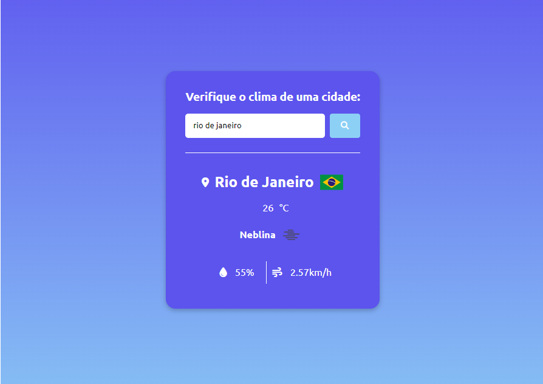

# Previsão do tempo
Este projeto consiste em um Website que consulta uma [API meteorológica](https://openweathermap.org/api) para exibir condições climáticas em tempo real.

### Explicação da consulta da API:
Contêm uma função assíncrona para esperar informações da API através de uma url personalizada, que é passada como Template Literal as variáveis que contenham a ${chave de API} e a ${cidade}, que foi escolhida pelo usuário no input.

### Tecnologias utilizadas:
- Html
- Css
- Javascript

### Para testar o site:
Por questões de segurança a chave da API foi ignorada ao postar o projeto. Para ter acesso as funcionalidades do site, clone o repositório e gere sua própria chave no site [API meteorológica](https://openweathermap.org/api), substitua no arquivo index.js, a linha ``` import { apiKey } from './config.js' ``` por ``` const apiKey = 'sua-chave-API' ``` 

### Captura de tela:



